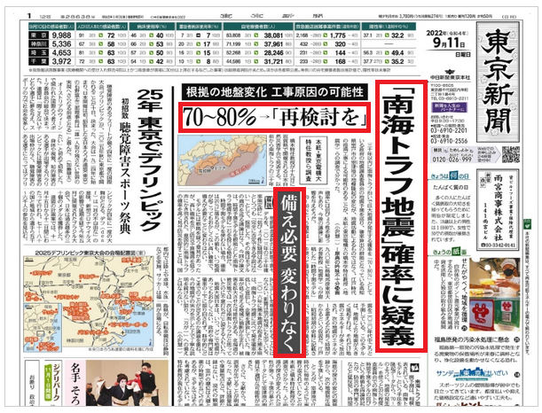

# タグとは何か

## h1, h2, h3タグ

見出しを表すタグです。

数字が小さいほど大きな見出しです。



```html
<h1>大見出し</h1>
<h2>中見出し</h2>
<h3>小見出し</h3>
```

<div style="border: 1px solid black">
    <h1>大見出し</h1>
    <h2>中見出し</h2>
    <h3>小見出し</h3>
</div>

## brタグ

改行を表すタグです。

```html
brタグは改行を表す。<br/>brタグを使わずに
単に改行するだけでは、改行せずに表示される。
```

<div class="example">
brタグは改行を表す。<br/>brタグを使わずに
単に改行するだけでは、改行せずに表示される。
</div>

## pタグ

段落を表すタグです。

```html
<p>
    吾輩は猫である。<br/>
    名前はまだない。
</p>
```

<div class="example">
    <p>
        吾輩は猫である。<br/>
        名前はまだない。
    </p>
</div>

## aタグ

リンクを表すタグです。

`href`属性にリンク先を設定します。

```html
<a href="https://www.google.com">ここ</a>からGoogleを開けます。
```

<div class="example">
    <a href="https://www.google.com">ここ</a>からGoogleを開けます。
</div>

## hrタグ

水平区切りを表すタグです。

```html
<hr/>
```

<div class="example">
    <hr/>
</div>

## ol, ulタグ

リストを表すタグです。

`ol`タグは順序付き(ordered)リストを表し、`ul`タグは順序なし(unordered)リストを表します。

リストの要素は、`li`タグを子要素に持つことで表します。

```html
<ol>
    <li>ハワイ旅行</li>
    <li>大型テレビ</li>
    <li>電気ケトル</li>
</ol>

<ul>
    <li>たんぽぽ</li>
    <li>ひまわり</li>
    <li>あさがお</li>
</ul>
```

<div class="example">
    <ol>
        <li>ハワイ旅行</li>
        <li>大型テレビ</li>
        <li>電気ケトル</li>
    </ol>
    <ul>
        <li>たんぽぽ</li>
        <li>ひまわり</li>
        <li>あさがお</li>
    </ul>
</div>

## 練習問題

次の内容をHTMLで記述してください。

ブログのURLは、`https://www.example.com`とします。

<div class="example">
    <h1>本日のメニュー</h1>
    <h2>前菜</h2>
    <ul>
        <li>サラダ</li>
        <li>生ハム</li>
        <li>スープ</li>
    </ul>
    <hr/>
    <h2>メイン</h2>
    <ul>
        <li>マルゲリータ</li>
        <li>クワトロ・フォルマッジ</li>
        <li>ボロネーゼ</li>
        <li>ペスカトーレ</li>
    </ul>
    <hr/>
    <h2>ドルチェ</h2>
    <ul>
        <li>バニラアイス</li>
        <li>ガトーショコラ</li>
    </ul>
    <p>
        当店で使用している小麦は、<br/>
        国内の契約農家から仕入れています！！<br/>
        詳しくは、<a href="https://www.example.com">当店のブログ</a>からご覧いただけます。
    </p>
</div>

## imgタグ

画像を表すタグです。

画像の場所を`src`属性で指定します。

```html

```

<div class="example">
    
</div>

## tableタグ

表を表すタグです。

表の内容は、子要素に`tr`タグ、`th`タグ、`td`タグなどを持たせることにより表します。

- trタグ: 表の行を表すタグです。
- thタグ：表のヘッダを表すタグです。
- tdタグ：表のデータを表すタグです。
- captionタグ：表のタイトルを表すタグです。

```html
<table>
    <caption>大学の学生数</caption>
    <tr>
        <th>京都大学</th>
        <th>同志社大学</th>
        <th>龍谷大学</th>
    </tr>
    <tr>
        <td>22,785人</td>
        <td>30,602人</td>
        <td>20,244人</td>
    </tr>
</table>
```

<div class="example">
    <table>
        <caption>大学の学生数</caption>
        <tr>
            <th>京都大学</th>
            <th>同志社大学</th>
            <th>龍谷大学</th>
        </tr>
        <tr>
            <td>22,785人</td>
            <td>30,602人</td>
            <td>20,244人</td>
        </tr>
    </table>
</div>

## 練習問題

次の内容をHTMLで記述してください。

<div class="example">
    <table>
        <caption>今週のスケジュール</caption>
        <tr>
            <th>月曜日</th>
            <th>火曜日</th>
            <th>水曜日</th>
            <th>木曜日</th>
            <th>金曜日</th>
        </tr>
        <tr>
            <td>
                <ul>
                    <li>授業</li>
                    <li>バイト</li>
                </ul>
            </td>
            <td>
                <ul>
                    <li>授業</li>
                    <li>サークル</li>
                </ul>
            </td>
            <td>
                <ul>
                    <li>授業</li>
                    <li>買い物</li>
                </ul>
            </td>
            <td>
                <ul>
                    <li>授業</li>
                    <li>サークル</li>
                </ul>
            </td>
            <td>
                <ul>
                    <li>授業</li>
                    <li>飲み会</li>
                </ul>
            </td>
        </tr>
    </table>
</div>

## spanタグ

インライン要素の範囲を表す。

```html
<span style="color: red">BIZ</span>REACH
```

<div class="example">
    <span style="color: red">BIZ</span>REACH
</div>

## divタグ

ブロック要素の範囲を表す。

```html
<div style="background-color: gray;">
    note <br/>
    divタグはcssやjavascriptの適用範囲を<br/>
    指定するために用いられることが多いです。
</div>
```

<div class="example">
    <div style="background-color: gray;">
        note <br/>
        divタグはcssやjavascriptの適用範囲を<br/>
        指定するために用いられることが多いです。
    </div>
</div>
