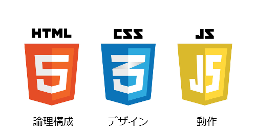
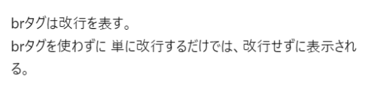

<!--
<style>
    div.example {
        background-color: white;
        color: black;
        padding: 1em;
        margin: 1em 0;
    }
    hr {
        background-color: black;
    }
</style>
-->

# タグとは

## Web制作でのHTMLの立ち位置

Web制作は、

- HTML
- CSS
- Javascript

の３つの言語を使って行われます。HTMLはWebページの論理構成を、CSSはWebページのデザインを、JavascriptはWebページの動的部分を担当しています。



例えば、KULASISのログイン画面では、ユーザー名やパスワードの入力欄はHTMLで設置し、CSSで装飾を施し、Javascriptでログインボタンが押されたときの動作を決めています。


論理構成、デザイン、動作を別々の言語で書くことにより、それぞれの分野を独立して設計することができます。

## HTMLファイルの内容

```html
<!DOCTYPE html>
<html>
    <head>
    </head>
    <body>
        Hello World!!
    </body>
</html>
```

１行目はファイルの種類を指定していて、２行目以降がhtmlファイルの内容です。

このファイルの構造は次の図のようになっています。


## タグ

`<...>`が要素の始まりを表し、`</...>`が要素の終わりを表しています。この`...`のことをタグといい、`<...>`を開始タグ、`</...>`を終了タグといいます。

例えば、`<html>`は`html`タグの開始タグです。

タグの中には別のタグを入れることができます。そのようにして、htmlファイルは階層構造を持ちます。


一部のタグは中に別のタグを持つことができません。そのようなタグを、self-closingタグといいます。このタグは、`<...>`もしくは`<.../>`と書きます。

タグには属性を持たせることができ、

```
<タグ 属性1=値1 属性2=値2 ...>
```

と書きます。


htmlファイルは様々なタグを組み合わせて作っていきます。ここでは、代表的なタグをいくつか紹介します。

## htmlタグ

HTMLのタグは全てhtmlタグの中に書いていきます。

## headタグ

Webページの設定を行います。
詳しくは次回説明します。

## bodyタグ

サイトの内容は、`body`タグの中に書いていきます。

`html`タグ、`head`タグ、`body`タグは必ず書かなければならないタグです。つまり、以下の内容がHTMLファイルに最低限書かなければならない内容です。

```html
<html>
    <head>
    </head>
    <body>
    </body>
</html>
```

この状態でブラウザで表示すると、真っ白な画面が表示されます。

## h1, h2, h3タグ

見出しを表すタグです。

数字が小さいほど大きな見出しです。


```html
<h1>大見出し</h1>
<h2>中見出し</h2>
<h3>小見出し</h3>
```


## brタグ

改行を表すタグです。

```html
brタグは改行を表す。<br/>brタグを使わずに
単に改行するだけでは、改行せずに表示される。
```



## pタグ

段落を表すタグです。

```html
<p>
    吾輩は猫である。<br/>
    名前はまだない。
</p>
```


## aタグ

リンクを表すタグです。

`href`属性にリンク先を設定します。

```html
<a href="https://www.google.com">ここ</a>からGoogleを開けます。
```


## hrタグ

水平区切りを表すタグです。

```html
<hr/>
```


## ol, ulタグ

リストを表すタグです。

`ol`タグは順序付き(ordered)リストを表し、`ul`タグは順序なし(unordered)リストを表します。

リストの要素は、`li`タグを子要素に持つことで表します。

```html
<ol>
    <li>ハワイ旅行</li>
    <li>大型テレビ</li>
    <li>電気ケトル</li>
</ol>

<ul>
    <li>たんぽぽ</li>
    <li>ひまわり</li>
    <li>あさがお</li>
</ul>
```


## 例題


```html
<html>
    <head>
    </head>
    <body>
        <h1>会議アジェンダ</h1>
        <ol>
            <li>アイスブレイク</li>
            <li>先月の売上を共有する</li>
            <li>今月の目標を決める</li>
        </ol>
    </body>
</html>
```

## 練習問題

次の内容をHTMLで記述してください。

ブログのURLは、`https://www.example.com`とします。

<!--
<div class="example">
    <h1>本日のメニュー</h1>
    <h2>前菜</h2>
    <ul>
        <li>サラダ</li>
        <li>生ハム</li>
        <li>スープ</li>
    </ul>
    <hr/>
    <h2>メイン</h2>
    <ul>
        <li>マルゲリータ</li>
        <li>クワトロ・フォルマッジ</li>
        <li>ボロネーゼ</li>
        <li>ペスカトーレ</li>
    </ul>
    <hr/>
    <h2>ドルチェ</h2>
    <ul>
        <li>バニラアイス</li>
        <li>ガトーショコラ</li>
    </ul>
    <p>
        当店で使用している小麦は、<br/>
        国内の契約農家から仕入れています！！<br/>
        詳しくは、<a href="https://www.example.com">当店のブログ</a>からご覧いただけます。
    </p>
</div>
-->


## imgタグ

画像を表すタグです。

画像の場所を`src`属性で指定します。

```html

```


## tableタグ

表を表すタグです。

表の内容は、子要素に`tr`タグ、`th`タグ、`td`タグなどを持たせることにより表します。

- trタグ: 表の行を表すタグです。
- thタグ：表のヘッダを表すタグです。
- tdタグ：表のデータを表すタグです。
- captionタグ：表のタイトルを表すタグです。

```html
<table>
    <caption>大学の学生数</caption>
    <tr>
        <th>京都大学</th>
        <th>同志社大学</th>
        <th>龍谷大学</th>
    </tr>
    <tr>
        <td>22,785人</td>
        <td>30,602人</td>
        <td>20,244人</td>
    </tr>
</table>
```


## 練習問題

次の内容をHTMLで記述してください。

<!--
<div class="example">
    <table>
        <caption>今週のスケジュール</caption>
        <tr>
            <th>月曜日</th>
            <th>火曜日</th>
            <th>水曜日</th>
            <th>木曜日</th>
            <th>金曜日</th>
        </tr>
        <tr>
            <td>
                <ul>
                    <li>授業</li>
                    <li>バイト</li>
                </ul>
            </td>
            <td>
                <ul>
                    <li>授業</li>
                    <li>サークル</li>
                </ul>
            </td>
            <td>
                <ul>
                    <li>授業</li>
                    <li>買い物</li>
                </ul>
            </td>
            <td>
                <ul>
                    <li>授業</li>
                    <li>サークル</li>
                </ul>
            </td>
            <td>
                <ul>
                    <li>授業</li>
                    <li>飲み会</li>
                </ul>
            </td>
        </tr>
    </table>
</div>
-->


## spanタグ

インライン要素の範囲を表すタグです。

CSSやJavascriptの適用範囲を指示するときなどに使います。

```html
<span style="color: red">BIZ</span>REACH
```


## divタグ

ブロック要素の範囲を表すタグです。

CSSやJavascriptの適用範囲を指示するときなどに使います。

```html
<div style="background-color: gray;">
    note <br/>
    divタグはcssやjavascriptの適用範囲を<br/>
    指定するために用いられることが多いです。
</div>
```


