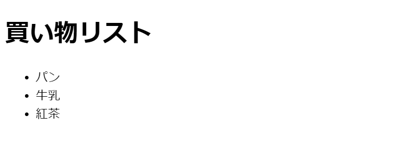
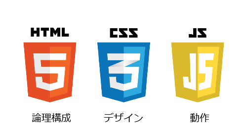
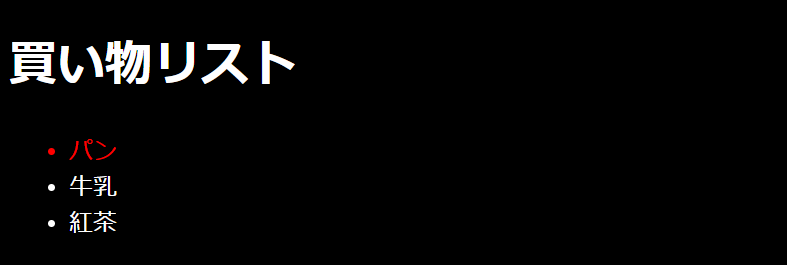
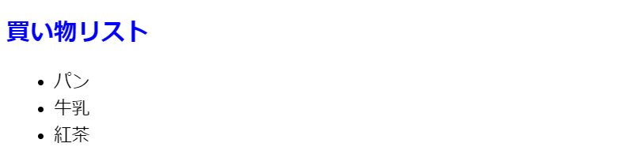
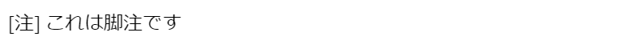
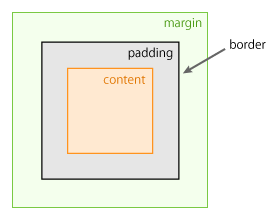
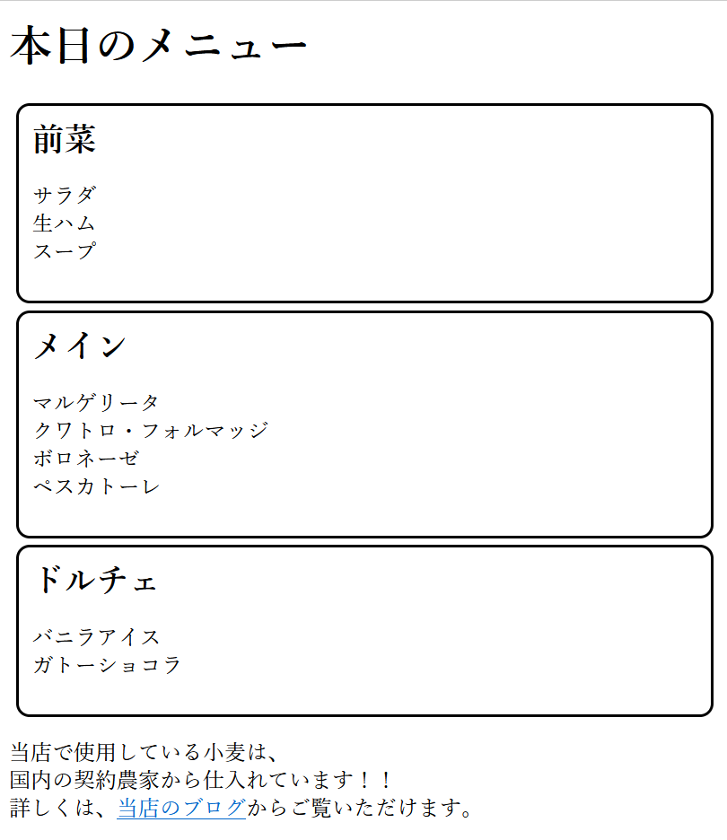
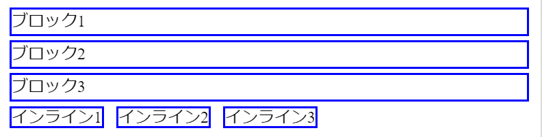
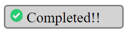

# Webデザイン１

## HTMLタグ

前回はHTMLファイルで使用する代表的なタグを学びました。

- htmlタグ
- bodyタグ
- h1, h2, h3タグ（見出し）
- brタグ（改行）
- pタグ（段落）
- aタグ（リンク）
- hrタグ（水平区切り）
- ol, ulタグ（リスト）
- imgタグ（画像）
- table, tr, th, tdタグ（表）
- span, divタグ（範囲指定）

## 復習

次の内容をHTMLファイルで書いてください。



<!--
```html
<!DOCTYPE html>
<html>
    <head></head>
    <body>
        <h1>買い物リスト</h1> 
        <ul>
            <li>パン</li>
            <li>牛乳</li>
            <li>紅茶</li>
        </ul>
    </body>
</html>
```
-->

## CSS



WebページのデザインはCSSを使って行います。HTMLのみを使う場合でも、ブラウザがデフォルトCSSを持っているため、ある程度はデザインが施された状態で表示されます。しかし、多くの場合は、デフォルトCSSでは満足できるデザインとならないため、自分でCSSを書く必要があります。

CSSは次のような形式で記述します。

```css
[CSSセレクタ] {
    [プロパティ1]: [値1];
    [プロパティ2]: [値2];
    ...
}
```

CSSファイル内には、複数のデザイン設定を記述できます。

```css
[CSSセレクタ１] {
    ...
}
[CSSセレクタ２] {
    ...
}
...
```

CSSセレクタでデザインの適用範囲を指定します。プロパティで設定内容を指定し、値で設定値を指定します。CSSで設定したプロパティは、子孫要素にも設定が受け継がれます。また、同じプロパティが複数回設定された場合は、最後に設定されたものが適用されます。

例えば、`img`タグで表示されている画像の表示サイズを指定したいときは次のように書きます。

```css
img {
    width: 100px;
    height: 100px;
}
```

## CSSファイルの読み込み

CSSファイルの読み込みには３つの方法があります。

### １．`link`タグで読み込む

`head`タグ内に、次のような`link`タグを書くことで、CSSファルを読み込むことができます。

```html
<head>
    <link href="[CSSファイルの場所]" type="stylesheet"/>
</head>
```

### ２．`style`タグでHTMLファイルに埋め込む

CSSファイルは、`style`タグを使って、HTMLファイルの中に組み込みます。`style`タグは、`body`要素の最後に置くことが普通です。

```html
<body>
    ...
    <style>
        img {
            width: 100px;
            height: 100px;
        }
    </style>
</body>
```

### ３．`style`属性を設定する

HTMLタグは`style`属性を持っており、ここにCSSの内容を設定することで、特定のHTML要素にデザインを適用することができます。

```html

```

## CSSセレクタ

デザインの適用範囲はCSSセレクタで指定します。CSSセレクタは、HTMLタグの種類、class、idなどでHTML要素を表します。HTMLタグ、class、idはそれぞれ省略できます。

```
[HTMLタグ].[class]#[id]
```

### class, id

全てのHTMLタグには、属性としてclassとidを持たせることができます。classの指定はHTMLファイル内で重複しても良いですが、idの指定は一意である必要があります。

#### HTMLファイル例

```html
<body>
    <h1>買い物リスト</h1>
    <ul>
        <li id="bread" class="product">パン</li>
        <li id="milk" class="product">牛乳</li>
        <li id="tea" class="product">紅茶</li>
    </ul>
</body>
```

#### CSSセレクタ例
```
li.product#bread
li.product
li
.product#bread
.product
#bread
```

### 複数指定

CSSセレクタでは、カンマ`,`で区切ることにより、複数のデザイン適用範囲を指定することができます。

#### 例

```
img, p, ul
```

### 親子関係

CSSセレクタでは、空白や山括弧`>`を使うことで、親子関係を指定条件に組み入れることができます。空白は子孫要素であることを、山括弧は直下の子要素であることを示します。

#### 例

```
body li
ul > li
```

## 例題１

```html
<body>
    <h1>買い物リスト</h1>
    <ul>
        <li id="bread" class="product">パン</li>
        <li id="milk" class="product">牛乳</li>
        <li id="tea" class="product">紅茶</li>
    </ul>
</body>
```



背景を黒色にして、文字を白色に、ただし「パン」のみは赤色にするCSSは次のように書きます。

```css
body {
    background-color: black;
    color: white;
}
#bread {
    color: red;
}
```

`body`タグに指定した背景色`background-color`と文字色`color`は子孫要素にも受け継がれるので、結局全ての要素に適用されます。その後で、`#bread`のみ文字色を赤色に設定し直しているため、「パン」のみ赤色になります。

## 練習問題１

例題１と同じHTMLファイルに別のデザインを適用します。



- 全体の文字サイズ`font-size`は`15px`
- 「買い物リスト」の文字サイズは`20px`
- 「買い物リスト」の文字色は青色`blue`

<!--
```css
body {
    font-size: 15px;
}
h1 {
    font-size: 20px;
    color: blue;
}
```
-->

## 疑似クラス

CSSでは、HTMLファイルの記述内容以外をCSSセレクタの条件に使用することもできます。よく使われるのが、マウスのカーソルが要素の上にあるという条件です。

こうした条件をCSSセレクタに導入するときは、擬似クラスというものを使います。擬似クラスの設定方法は次の通りです。

```
:[擬似クラス名]
```

マウスのカーソルが要素の上にあるという条件は、`hover`擬似クラスで表します。

例えば、`a`タグの上にマウスのカーソルがある場合に、`a`タグの色を灰色`gray`に変えるCSSは次のように書きます。

```css
a:hover {
    color: gray;
}
```

## 疑似要素

疑似要素を使うと、見かけ上、新しいHTML要素をCSSで作り出すことができます。

例えば、`before`疑似要素を使うと、既存のHTML要素の先頭に、見かけ上の要素を追加できます。



```html
<body>
    <span class="note">これは脚注です</span>
    <style>
        .note::before {
            content: "[注]";
        }
    </style>
</body>
```

## 余白・枠線



### marginの相殺

### `box-sizing`プロパティ

### `border-radius`プロパティ

## 練習問題２

前回作成した「本日のメニュー」を元に、次のような内容のページをHTMLとCSSで作成してください。特に、余白の幅感や枠線の形に注意してください。

`li`要素の前に付いている黒丸は、

```css
ul {
    list-style: none;
}
```

で消すことができます。



> ヒント：`hr`要素は不要なので削除します。`h2`要素と`ul`要素を含むように`div`要素を新たに作成し、各`div`タグに同一classを設定します。

```html
<div class="menu">
    <h2>前菜</h2>
    <ul>
        ...
    </ul>
</div>
```

## ブロック要素とインライン要素

HTMLの要素には、ブロック要素とインライン要素があります。ブロック要素は親要素の横幅いっぱいに表示されますが、インライン要素は内部コンテンツの大きさが横幅になります。



|block要素|inline要素|
|-|-|
|h1, h2, h3|a|
|p|span|
|hr|img|
|ol, ul||
|table||
|div||

インライン要素では上下marginを設定することができません。また、インライン要素のpaddingは、上下の要素と重なって表示されるため、インライン要素のpaddingの使用は非推奨です。

また、インライン要素には横幅`width`と高さ`height`を設定することもできません。

### `display`プロパティ

CSSの`display`プロパティで、ブロック要素として扱うか、インライン要素として扱うか設定することができます。

```
display: block, inline
```

## 練習問題３

次にような内容をHTMLとCSSで書いてください。



チェックアイコン画像は下記URLから取得できます。

https://upload.wikimedia.org/wikipedia/commons/thumb/c/c6/Sign-check-icon.png/768px-Sign-check-icon.png

デザインの要件は次の通りです。

- 幅は150px
- 画像の高さは20px
- 文字の大きさは20px
- 背景色は`lightgray`
- 枠線色は`gray`
