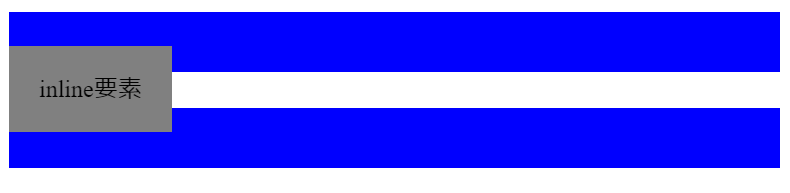
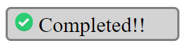
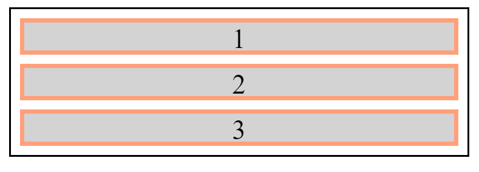
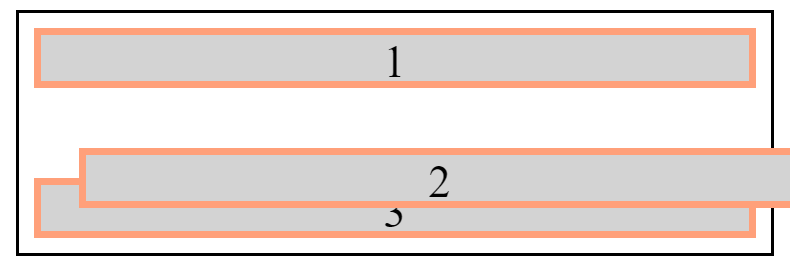
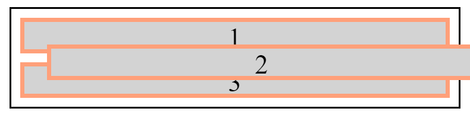

# Webデザイン２

## ブロック要素とインライン要素

HTMLの要素には、ブロック要素とインライン要素があります。ブロック要素は親要素の横幅いっぱいに表示されますが、インライン要素は内部コンテンツの大きさが横幅になります。


|block要素|inline要素|
|-|-|
|h1, h2, h3|a|
|p|span|
|hr|img|
|ol, ul||
|table||
|div||

インライン要素では上下marginを設定することができません。また、インライン要素のpaddingは、上下の要素と重なって表示されるため、インライン要素のpaddingの使用は非推奨です。



また、インライン要素には横幅`width`と高さ`height`を設定することもできません。

### `display`プロパティ

CSSの`display`プロパティで、ブロック要素として扱うか、インライン要素として扱うか設定することができます。また、`none`とすると、要素を非表示にできます。

```
display: block, inline, none
```

## 練習問題１

次にような内容をHTMLとCSSで書いてください。



チェックアイコン画像は下記URLから取得できます。

https://upload.wikimedia.org/wikipedia/commons/thumb/c/c6/Sign-check-icon.png/768px-Sign-check-icon.png

デザインの要件は次の通りです。

- 幅は150px
- 画像の高さは20px
- 文字の大きさは20px
- 背景色は`lightgray`
- 枠線色は`gray`

## 配置

HTML要素のページ内配置方法は、`position`プロパティを使って設定します。また、配置座標は、`top`、`bottom`、`left`、`right`プロパティで設定します。

```
position: static, relative, absolute, fixed
```

### position: static



`position`プロパティの既定値です。要素は通常のフローに従って配置されます。また、`top`、`bottom`、`left`、`right`プロパティは使用できません。

### position: relative



要素は通常のフローに従って配置されます。`top`、`bottom`、`left`、`right`プロパティによって、元々表示されるはずだった位置に相対配置されます。つまり、その要素からの相対座標により、表示位置を設定できます。

### position: absolute



要素は通常のフローから除外され、ページ内に要素のための空間が確保されません。祖先要素の内、`position`が`static`以外の要素に対して、相対配置されます。

## 例題１


```html
<div>
        
    <span>海の生命</span>
</div>
<style>
    div {
        position: relative;
    }
    img {
        width: 100%;
    }
    span {
        position: absolute;
        bottom: 0;
        right: 0;
        color: white;
        font-size: 50px;
        margin-right: 30px;
        margin-bottom: 20px;
    }
</style>
```

## 練習問題２


`mark` classが指定されたキーワードに、赤色の下線を引くCSSのうち、`???`の部分を埋めてください。なお、`::before`は疑似要素といい、HTML要素の前に見かけ上の要素を追加するCSSの機能です。

```html
関ケ原の戦いでは、
<span class="mark">徳川家康</span>
が総大将の東軍と、
<span class="mark">毛利輝元</span>
が総大将の西軍が戦った。

<style>
    span {
        position: ???;
    }
    span.mark::before {
        content: "";
        display: inline-block;
        background-color: red;
        height: 3px;
        width: 100%;
        position: ???;
        bottom: ???;
    }
</style>
```
